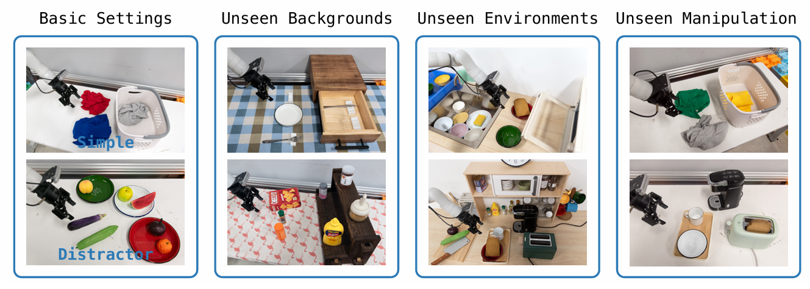

<!--  -->

**Talker**: [Ning Gao](https://axi404.top/)

**Bio**: Ning Gao is a 3rd year student from XJTU. He is conducting a scientific internship in the Embodied Intelligence Center of Shanghai Artificial Intelligence Laboratory (SHAILAB), and is engaged in research in the field of Embodied Intelligence Manipulation

**Key note**: 
- Paper sharing and discussion on the dual-system model in Gemini-Robotics, HiRobot, and other relevant frameworks.
- Provide a personal definition of the dual-system framework in embodied AI.
- Comparative analysis of end-to-end, dual-system, and prompt-based models. Highlight the advantages and limitations of each approach in embodied tasks.
- Define the function in VLA and VLM for embodied system
- Discussion future trend in embodied AI
